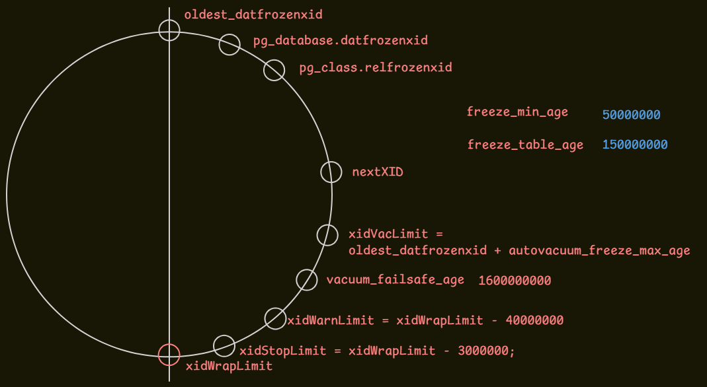

# Freeze

**概要**：XID 仅 32 位，用尽后会回绕。若页中老元组的 `xmin` 与当前 XID 的间隔逼近 2³¹，该元组会被误判为「未来事务插入」而不可见。freeze 在回绕临近前，将足够老的元组标记为**永久已提交**：此后判定可见性无需再查询 `pg_xact`（clog）。


## 1. XID wraparound

- XID 仅 32 位，约 42 亿个即告耗尽，PostgreSQL 将其视为环形计数器
- 分配至 2³²−1 后回绕至 3，先后关系按模 2³² 的**有符号差**计算

```c
TransactionIdPrecedes(a, b) ≡ (int32)(a - b) < 0   /* 过去与未来各占 2³¹ */
```

> Linux 同类型判断: https://github.com/torvalds/linux/blob/master/include/linux/jiffies.h

由此产生一个问题：设某元组 `xmin = 5`（对应早已提交的事务），只要系统持续分配 XID，该值与 `nextXID` 的间隔便不断增大。当间隔逼近 2³¹ 时，`(int32)(5 - nextXID)` 的符号发生翻转，该元组将被判定为「未来事务插入」，对所有快照不可见，等价于数据丢失；且若 clog 已截断，其提交记录亦无从查证。

对策（freeze）：在间隔逼近 2³¹ 之前，将老元组的可见性判定由「依据 XID 与 clog」改为「永久可见」。一次冻结产生三项结果：

1. **可见性**：设置 `HEAP_XMIN_FROZEN` 后，任何快照无需查询 clog 即可判定该元组可见；
2. **推进 `relfrozenxid`**：该字段语义为「表中所有 `XID < relfrozenxid` 的元组均已冻结（或不存在）」，即表内仍需查询 clog 的 XID 下界；其值推进越远，后续冻结工作量越小；
3. **clog 截断**：全库各表 `relfrozenxid` 的最小值记录于 `datfrozenxid`，早于该值的 `pg_xact` 段可由 `vac_truncate_clog()` 删除。


## 2. `HEAP_XMIN_FROZEN`

冻结并非改写数据，而是修改元组头 `infomask` 的两个位，合成「永久已提交」标记：

```c
#define HEAP_XMIN_COMMITTED 0x0100   /* hint bit：xmin 已提交 */
#define HEAP_XMIN_INVALID   0x0200   /* 单独出现时表示 xmin 已 abort */
#define HEAP_XMIN_FROZEN    (HEAP_XMIN_COMMITTED | HEAP_XMIN_INVALID)  /* = 0x0300：永久已提交 */
```

---

## 4. freeze age

| 参数                          | 默认值                    | 触发后行为                                            | 跳过 all-visible |
| --------------------------- | ---------------------- | ------------------------------------------------ | -------------- |
| `vacuum_freeze_min_age`     | **50,000,000** (5千万)   | 常规 VACUUM, 扫到页面时顺手冻结                             | 是              |
| `vacuum_freeze_table_age`   | **150,000,000** (1.5亿) | Aggressive VACUUM                                | 否              |
| `autovacuum_freeze_max_age` | **200,000,000** (2亿)   | Anti-wraparound autovacuum，即便 `autovacuum=false` | 否              |

## 5. freeze process

冻结实现分为两阶段
- prepare 可能读取 clog / multixact（代价较高），在临界区外执行；
- execute 改写 tuple 头并写入 WAL，在临界区内原子完成，以尽量缩短持锁时间。

### 5.1 prepare

prune 之后，对每个 `LP_NORMAL` 元组先用 `HeapTupleSatisfiesVacuum` 确认其存活（DEAD 元组在 prune 阶段已被移除，不会进入冻结流程），再调用 `heap_prepare_freeze_tuple()`，在内存中构造 `HeapTupleFreeze` 计划（目标 xmax / infomask / frzflags / checkflags），同时维护页级 `HeapPageFreeze` 状态。各字段的判定如下：

| 字段            | 冻结条件                  | 动作                                                    |
| ------------- | --------------------- | ----------------------------------------------------- |
| `xmin`        | `< OldestXmin`        | `infomask \|= HEAP_XMIN_FROZEN`；执行时复核 committed       |
| `xmax`（普通）    | `< OldestXmin`        | 清空 xmax、置 `HEAP_XMAX_INVALID`；非 lock-only 则复核 aborted |
| `xmax`（multi） | `FreezeMultiXactId()` | 四种处理结果，见下                                             |
| `xvac`        | 存在即冻结                 | 写入 `FrozenTransactionId` / Invalid                    |

两点说明：

- 已提交 updater 的 xmax 不可能 < `OldestXmin`（否则整个元组早已 DEAD 并被移除），因此进入 freeze_xmax 路径的仅有 **lock-only 与 aborted updater**；
- **不信任 hint bit**：checkflags（如 `HEAP_FREEZE_CHECK_XMIN_COMMITTED`）要求在执行阶段的临界区之外复核 clog（代价高，不能反复执行），复核失败即报 `DATA_CORRUPTED`。

`FreezeMultiXactId()` 的四种处理结果（除 NOOP 外均强制 `freeze_required`）：

| flags                 | 场景                          | 动作                                        |
| --------------------- | --------------------------- | ----------------------------------------- |
| `FRM_NOOP`            | multi 尚新（成员可能 in-progress）  | 原样保留，仅回退 NoFreeze 追踪器                     |
| `FRM_INVALIDATE_XMAX` | 旧 multi 且 lock-only / 成员均可弃 | 直接清空 xmax                                 |
| `FRM_RETURN_IS_XID`   | 仅剩一个 updater 成员             | 以普通 XID 替换 multi（可附 `FRM_MARK_COMMITTED`） |
| `FRM_RETURN_IS_MULTI` | ≥ 2 个存活成员                   | 分配仅含存活成员的新 multi（尽量避免）                    |

处理 multi 的目的：避免旧 multi 推迟 `relminmxid` 的推进，并减少对 SLRU 的重复访问。

### 5.2 execute

按页决策，满足下列任一条件即进入 freeze path：

```text
pagefrz.freeze_required                             -- 页内含 < FreezeLimit 的 XID，必须冻结
OR tuples_frozen == 0                               -- 无任何冻结计划，执行代价可忽略；且页面因此可标记 all-frozen
OR (all_visible && all_frozen && prune 已产生 FPI)   -- 页面因 prune 已生成 FPI、必然写 WAL，可一并完成冻结
```

- **freeze path**：`heap_freeze_execute_prepared()` 在临界区内逐元组调用 `heap_execute_freeze_tuple()` 并写 WAL（§6）；页级追踪器采用 `FreezePageRelfrozenXid/RelminMxid`；
- **no-freeze path**：追踪器采用 `NoFreezePage*`（回退至页内仍残留的最老 XID），并强制 `all_frozen = false`——仅执行 freeze path 的页面才可能被标记为 VM all-frozen。

当各存活元组的 xmin/xmax 均已（或将）冻结（`totally_frozen`）时，页级 `all_frozen` 成立；其与 `all_visible` 共同决定 `lazy_scan_heap` 是否调用 `visibilitymap_set(..., ALL_VISIBLE | ALL_FROZEN)`。

---

## 8. failsafe

`SetTransactionIdLimit()`（`varsup.c`）以全库最老 `datfrozenxid` 为基准设置四级阈值：

```c
xidWrapLimit = oldest_datfrozenxid + (MaxTransactionId >> 1);
xidStopLimit = xidWrapLimit - 3000000;
xidWarnLimit = xidWrapLimit - 40000000;
xidVacLimit = oldest_datfrozenxid + autovacuum_freeze_max_age; /* 2亿*/
```

| 界限             | 计算                                   | 年龄（相对 oldest）     | 触发动作                          |
| -------------- | ------------------------------------ | ----------------- | ----------------------------- |
| `xidVacLimit`  | `oldest + autovacuum_freeze_max_age` | **2 亿**           | 发信号催 autovacuum（每 64K 一次）     |
| `xidWarnLimit` | `xidWrapLimit - 40,000,000`          | **≈21.07 亿**      | 打 WARNING "必须在 N 个事务内 vacuum" |
| `xidStopLimit` | `xidWrapLimit - 3,000,000`           | **≈21.44 亿**      | ERROR 拒绝分配 XID（单用户模式除外）       |
| `xidWrapLimit` | `oldest + (MaxTransactionId >> 1)`   | **≈21.47 亿（2³¹）** | 逻辑回绕、数据丢失点                    |

> **failsafe**（PG 12+）：表 `relfrozenxid` 老于 `max(vacuum_failsafe_age, 1.05 × autovacuum_freeze_max_age)`（默认 16 亿）时，正在进行的 aggressive VACUUM 放弃索引清理与表截断，仅以尽快推进 `relfrozenxid` 为目标。

---

## 9. Call stack

```text
ExecVacuum | vacuum /* vacuum relations or all releated tables */
    vacuum_rel
        /* or cluster_rel for vacuum full */
        table_relation_vacuum | heap_vacuum_rel /* perform VACUUM for one heap relation */
            lazy_scan_heap      /* heap pruning + index vac + heap vac */
                lazy_scan_prune /* prune heap pages */
                    heap_page_prune /* prune one page */
	                    ...
                    heap_prepare_freeze_tuple
                    heap_freeze_execute_prepared  /* freeze heap tuples */
                        heap_execute_freeze_tuple /* Execute the prepared freezing of a tuple with caller's freeze plan */
```

---

## 10. case

- 基础：观察 infomask 变化、relfrozenxid 推进与 VM 标记

```sql
CREATE EXTENSION IF NOT EXISTS pageinspect;
CREATE EXTENSION IF NOT EXISTS pg_visibility;

DROP TABLE IF EXISTS test_freeze;
CREATE TABLE test_freeze (id int PRIMARY KEY, val int)
  WITH (autovacuum_enabled = off);

INSERT INTO test_freeze VALUES (1, 1), (2, 2), (3, 3);

-- 冻结前：t_infomask = 2048 (HEAP_XMAX_INVALID)，尚无 xmin hint
SELECT lp, t_xmin, t_xmax, t_infomask, to_hex(t_infomask)
FROM heap_page_items(get_raw_page('test_freeze', 0));

SELECT relfrozenxid, age(relfrozenxid) FROM pg_class WHERE relname = 'test_freeze';

VACUUM FREEZE test_freeze;

-- 冻结后：t_xmin 不变；t_infomask = 2816 = 2048 | 0x0300 (HEAP_XMIN_FROZEN)
SELECT lp, t_xmin, t_xmax, t_infomask, to_hex(t_infomask)
FROM heap_page_items(get_raw_page('test_freeze', 0));

SELECT relfrozenxid, age(relfrozenxid) FROM pg_class WHERE relname = 'test_freeze';

-- VM：页面已标记 all-visible + all-frozen
SELECT blkno, all_visible, all_frozen FROM pg_visibility_map('test_freeze');
```