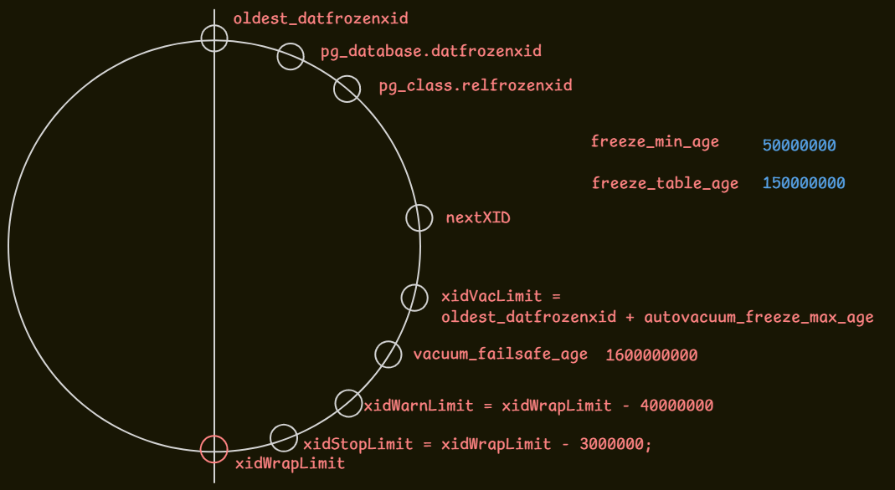

# Freeze

**概要**：XID 仅 32 位，用尽后会回绕。若页中老元组的 `xmin` 与当前 XID 的间隔逼近 2³¹，该元组会被误判为「未来事务插入」而不可见。freeze 在回绕临近前，将足够老的元组标记为**永久已提交**：此后判定可见性无需再查询 `pg_xact`（clog）。


## 1. XID wraparound

- XID 仅 32 位，约 42 亿个即告耗尽，PostgreSQL 将其视为环形计数器
- 分配至 2³²−1 后回绕至 3，先后关系按模 2³² 的**有符号差**计算

```c
TransactionIdPrecedes(a, b) ≡ (int32)(a - b) < 0   /* 过去与未来各占 2³¹ */
```

> Linux 同类型判断: https://github.com/torvalds/linux/blob/master/include/linux/jiffies.h

问题：设某元组 `xmin = 5`（对应早已提交的事务），只要系统持续分配 XID，该值与 `nextXID` 的间隔便不断增大。当间隔逼近 2³¹ 时，`(int32)(5 - nextXID)` 的符号发生翻转，该元组将被判定为「未来事务插入」，对所有快照不可见，等价于数据丢失；且若 clog 已截断，其提交记录亦无从查证。

对策（freeze）：在间隔逼近 2³¹ 之前，将老元组的可见性判定由「依据 XID 与 clog」改为「永久可见」。一次冻结产生三项结果：

1. **可见性**：设置 `HEAP_XMIN_FROZEN` 后，任何快照无需查询 clog 即可判定该元组可见；
2. **推进 `relfrozenxid`**：该字段语义为「表中所有 `XID < relfrozenxid` 的元组均已冻结（或不存在）」，即表内仍需查询 clog 的 XID 下界；其值推进越远，后续冻结工作量越小；
3. **clog 截断**：全库各表 `relfrozenxid` 的最小值记录于 `datfrozenxid`，早于该值的 `pg_xact` 段可由 `vac_truncate_clog()` 删除。


## 2. `HEAP_XMIN_FROZEN`

冻结并非改写数据，而是修改元组头 `infomask` 的两个位，合成「永久已提交」标记：

```c
#define HEAP_XMIN_COMMITTED 0x0100   /* hint bit：xmin 已提交 */
#define HEAP_XMIN_INVALID   0x0200   /* 单独出现时表示 xmin 已 abort */
#define HEAP_XMIN_FROZEN    (HEAP_XMIN_COMMITTED | HEAP_XMIN_INVALID)  /* = 0x0300：永久已提交 */
```

---

## 4. freeze age

| 参数                        | 默认值                  | 触发后行为                                                           | 跳过 all-visible |
| --------------------------- | ----------------------- | -------------------------------------------------------------------- | ---------------- |
| `vacuum_freeze_min_age`     | **50,000,000** (5千万)  | 常规 VACUUM, 扫到页面时顺手冻结                                      | 是               |
| `vacuum_freeze_table_age`   | **150,000,000** (1.5亿) | Aggressive VACUUM                                                    | 否               |
| `autovacuum_freeze_max_age` | **200,000,000** (2亿)   | forced vacuum<br>Anti-wraparound autovacuum，即便 `autovacuum=false` | 否               |

## 5. freeze process

两阶段：读 clog 的高代价判定放临界区外，临界区内只做内存改写与 WAL。

| 阶段    | 入口                             | 位置     | 职责                                                     |
| ------- | -------------------------------- | -------- | -------------------------------------------------------- |
| prepare | `heap_prepare_freeze_tuple()`    | 临界区外 | 逐元组生成 `HeapTupleFreeze` 计划，维护页级 `HeapPageFreeze` |
| execute | `heap_freeze_execute_prepared()` | 临界区内 | 复核 clog、改 tuple 头、写 `XLOG_HEAP2_FREEZE_PAGE`      |

- `HeapTupleFreeze`：目标 `xmax` / `t_infomask` / `t_infomask2` / `frzflags`（xvac）/ `checkflags`（待复核）/ `offset`；
- `HeapPageFreeze`：`freeze_required` + freeze / no-freeze 两套 `NewRelfrozenXid`（§5.2）。

### 5.1 prepare

`lazy_scan_prune()` 在 `heap_page_prune()` 后，对每个非 DEAD 的 `LP_NORMAL` 元组调用 `heap_prepare_freeze_tuple()`：初始化计划后逐字段判定，返回是否有可用计划，输出 `*totally_frozen`，并维护 `pagefrz`。落在 `relfrozenxid` 之前即报 `DATA_CORRUPTED`。

| 字段            | 条件                  | 计划动作                                    | checkflag                                       |
| --------------- | --------------------- | ------------------------------------------- | ----------------------------------------------- |
| `xmin`          | 非普通 XID            | 已冻结                                      | —                                               |
|                 | `< OldestXmin`        | `t_infomask \|= HEAP_XMIN_FROZEN`           | `..._XMIN_COMMITTED`                            |
| `xvac`          | 普通 XID              | 冻结（MOVED_OFF 置 Invalid）                | —                                               |
| `xmax`          | `< OldestXmin`        | 清空 xmax、`\|= HEAP_XMAX_INVALID`          | 非 lock-only 时 `..._XMAX_ABORTED`              |

- 复核推迟到 execute：prepare 仅登记 `checkflags`，查 clog 在临界区前、每页一次；
- freeze_xmax 只会遇到 **lock-only 与 aborted updater**——已提交 updater 的 xmax `< OldestXmin` 时元组早已 DEAD 被 prune。

> 本节 xmax 暂只讨论普通 XID；`HEAP_XMAX_IS_MULTI`（MultiXactId）路径暂略。

### 5.2 execute

`lazy_scan_prune()` 按页二选一，进入 **freeze path** 的条件：

```c
/* lazy_scan_prune() @ vacuumlazy.c */
if (pagefrz.freeze_required ||              /* 页内有 < FreezeLimit 的 XID */
    tuples_frozen == 0 ||                   /* 无计划，零成本且可标 all-frozen */
    (prunestate->all_visible && prunestate->all_frozen &&
     fpi_before != pgWalUsage.wal_fpi))     /* prune 新增了 FPI，反正要写 WAL */
```

- **freeze path**：追踪器用 `FreezePage*`；`tuples_frozen > 0` 时算 `snapshotConflictHorizon` 再调 `heap_freeze_execute_prepared()`：临界区外按 `checkflags` 复核 clog（不符报 `DATA_CORRUPTED`）→ `START_CRIT_SECTION()` → 逐元组 `heap_execute_freeze_tuple()` → `MarkBufferDirty()` → `XLogInsert(XLOG_HEAP2_FREEZE_PAGE)`（计划去重）→ `END_CRIT_SECTION()`。
- **no-freeze path**：追踪器用 `NoFreezePage*`（回退到页内最老 XID），强制 `all_frozen = false`、`tuples_frozen = 0`；只有 freeze path 的页才可能标 all-frozen。

`all_frozen` 初值 true，任一 `!totally_frozen` 元组即置 false；与 `all_visible` 共同决定 `visibilitymap_set(..., ALL_VISIBLE | ALL_FROZEN)`。

---

## 6. failsafe

`SetTransactionIdLimit()`（`varsup.c`）以全库最老 `datfrozenxid` 为基准设置四级阈值：

```c
xidWrapLimit = oldest_datfrozenxid + (MaxTransactionId >> 1);
xidStopLimit = xidWrapLimit - 3000000;
xidWarnLimit = xidWrapLimit - 40000000;
xidVacLimit = oldest_datfrozenxid + autovacuum_freeze_max_age; /* 2亿*/
```

| 界限           | 计算                                 | 年龄（相对 oldest）  | 触发动作                              |
| -------------- | ------------------------------------ | -------------------- | ------------------------------------- |
| `xidVacLimit`  | `oldest + autovacuum_freeze_max_age` | **2 亿**             | 发信号催 autovacuum（每 64K 一次）    |
| `xidWarnLimit` | `xidWrapLimit - 40,000,000`          | **≈21.07 亿**        | 打 WARNING "必须在 N 个事务内 vacuum" |
| `xidStopLimit` | `xidWrapLimit - 3,000,000`           | **≈21.44 亿**        | ERROR 拒绝分配 XID（单用户模式除外）  |
| `xidWrapLimit` | `oldest + (MaxTransactionId >> 1)`   | **≈21.47 亿（2³¹）** | 逻辑回绕、数据丢失点                  |

> **failsafe**（PG 12+）：表 `relfrozenxid` 老于 `max(vacuum_failsafe_age, 1.05 × autovacuum_freeze_max_age)`（默认 16 亿）时，正在进行的 aggressive VACUUM 放弃索引清理与表截断，仅以尽快推进 `relfrozenxid` 为目标。

---

## 7. Call stack

```text
ExecVacuum | vacuum /* vacuum relations or all releated tables */
    vacuum_rel
        /* or cluster_rel for vacuum full */
        table_relation_vacuum | heap_vacuum_rel /* perform VACUUM for one heap relation */
            lazy_scan_heap      /* heap pruning + index vac + heap vac */
                lazy_scan_prune /* prune heap pages */
                    heap_page_prune /* prune one page */
	                    ...
                    heap_prepare_freeze_tuple
                    heap_freeze_execute_prepared  /* freeze heap tuples */
                        HEAP_FREEZE_CHECK_XXXXXX  /* Perform xmin/xmax XID status sanity checks before critical section */
                        heap_execute_freeze_tuple /* Execute the prepared freezing of a tuple with caller's freeze plan */
```

---

## 9. case

- 基础：观察 infomask 变化、relfrozenxid 推进与 VM 标记

```sql
CREATE EXTENSION IF NOT EXISTS pageinspect;
CREATE EXTENSION IF NOT EXISTS pg_visibility;

DROP TABLE IF EXISTS test_freeze;
CREATE TABLE test_freeze (id int PRIMARY KEY, val int)
  WITH (autovacuum_enabled = off);

INSERT INTO test_freeze VALUES (1, 1), (2, 2), (3, 3);

-- 冻结前：t_infomask = 2048 (HEAP_XMAX_INVALID)，尚无 xmin hint
SELECT lp, t_xmin, t_xmax, t_infomask, to_hex(t_infomask)
FROM heap_page_items(get_raw_page('test_freeze', 0));

SELECT relfrozenxid, age(relfrozenxid) FROM pg_class WHERE relname = 'test_freeze';

VACUUM FREEZE test_freeze;

-- 冻结后：t_xmin 不变；t_infomask = 2816 = 2048 | 0x0300 (HEAP_XMIN_FROZEN)
SELECT lp, t_xmin, t_xmax, t_infomask, to_hex(t_infomask)
FROM heap_page_items(get_raw_page('test_freeze', 0));

SELECT relfrozenxid, age(relfrozenxid) FROM pg_class WHERE relname = 'test_freeze';

-- VM：页面已标记 all-visible + all-frozen
SELECT blkno, all_visible, all_frozen FROM pg_visibility_map('test_freeze');
```
